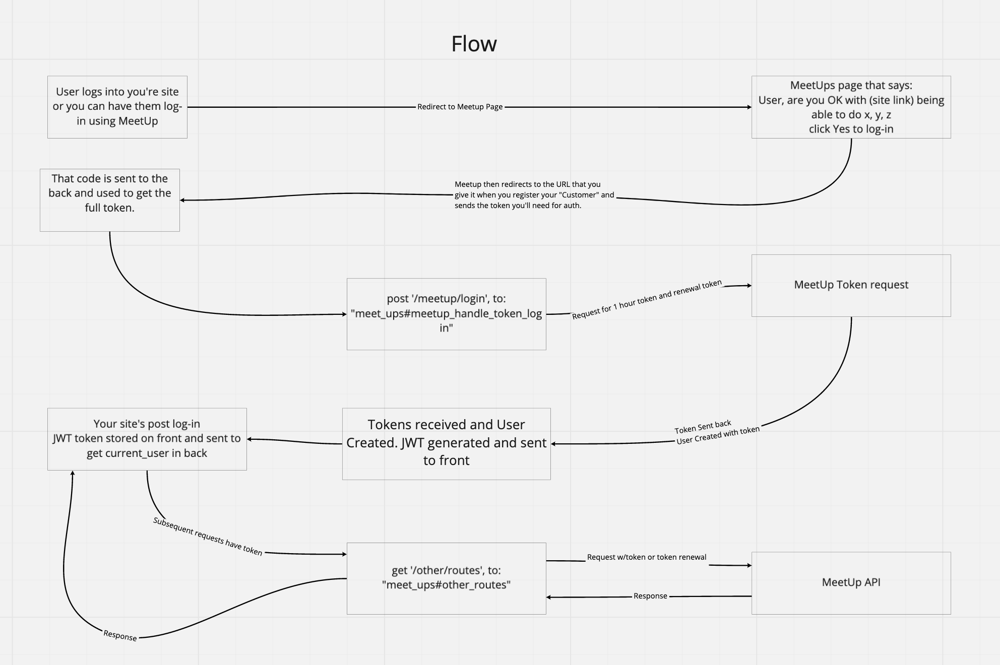

# This is a simple React frontend model for MeetUp oauth2 with a rails backend 
[Link to the backend](https://github.com/wley3337/meetup-restructure-back)

### General Information:
* .envExample has the model for env variables. 
* You'll need to register a [MeetUp Consumer](https://secure.meetup.com/meetup_api/oauth_consumers/create/) in order to use oauth2. 
* The MeetUp Exchange for this app is: 

